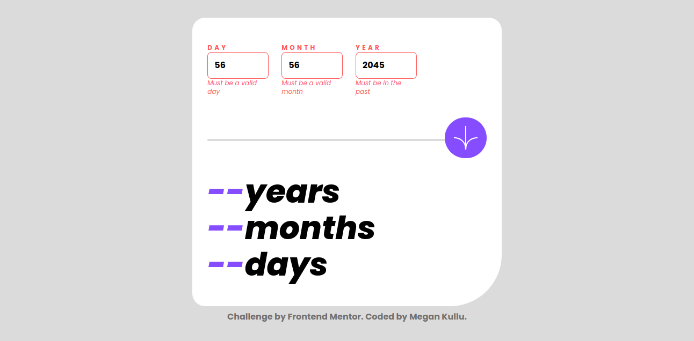

# Frontend Mentor - Age calculator app solution

This is a solution to the [Age calculator app challenge on Frontend Mentor](https://www.frontendmentor.io/challenges/age-calculator-app-dF9DFFpj-Q). Frontend Mentor are designed one improve their coding skills by building realistic projects. 

## Table of contents

- [Overview](#overview)
  - [The challenge](#the-challenge)
  - [Screenshot](#screenshot)
  - [Links](#links)
- [My process](#my-process)
  - [Built with](#built-with)
  - [What I learned](#what-i-learned)
  - [Continued development](#continued-development)
  - [Useful resources](#useful-resources)
- [Author](#author)


## Overview

### The challenge

The challenge was to;

- View an age in years, months, and days after submitting a valid date through the form
- Receive validation errors if:
  - Any field is empty when the form is submitted
  - The day number is not between 1-31
  - The month number is not between 1-12
  - The year is in the future
  - The date is invalid e.g. 31/04/1991 (there are 30 days in April)
- View the optimal layout for the interface depending on their device's screen size
- See hover and focus states for all interactive elements on the page


### Screenshot




### Links

- Solution URL: [The URL here](https://your-solution-url.com)
- Live Site URL: [My live site](https://your-live-site-url.com)

## My process

Started off by building the structure with HTML.
Added some basic styling such as font family, color scheme etc using variables from TailwindCSS library 
I used flex box to align items vertically as well as center them horizontally by justifying them center.
Created a app.js file that would query the inputs and perform calculations. Added event listeners for real time validation and created functions that updated the outputs dynamically.
Made sure to consider leap years and months with different days in order for my results to be as accurate as possible.

### Built with

- Semantic HTML5 markup
- CSS custom properties
- Flexbox
- CSS Grid
- Mobile-first workflow
- JS Query
- [Tailwind CSS](https://tailwindcss.com/) - CSS Library


### What I learned

This was an engaging project and I learnt a lot along the process. I learnt how to use the Date function and accessed dates, months and year by object notation. Learnt how to order my functions so that when I call my functions that the code behaves accordingly.

```javascript
function leapYear(year) {
    if (year === undefined) {
      return false;
    }
  else return year % 100 === 0 ? year % 400 === 0 : year % 4 === 0;
}
```
Here's an example of a function that checks whether or not it is a Leap Year in JavaScript.

### Continued development

I would like to practice further on css animations.

### Useful resources

- [Scaler.com](https://www.scaler.com/topics/get-current-date-in-javascript/) - This helped me in learning how to extract the various values of the Date() object.
- [Mozilla.org](https://www.example.com) - This is an amazing article which helped me finally understand ternary operators.

## Author

- Frontend Mentor - [@MeganKullu](https://www.frontendmentor.io/profile/MeganKullu)
- Twitter - [@megankullu](https://www.twitter.com/megankullu)


